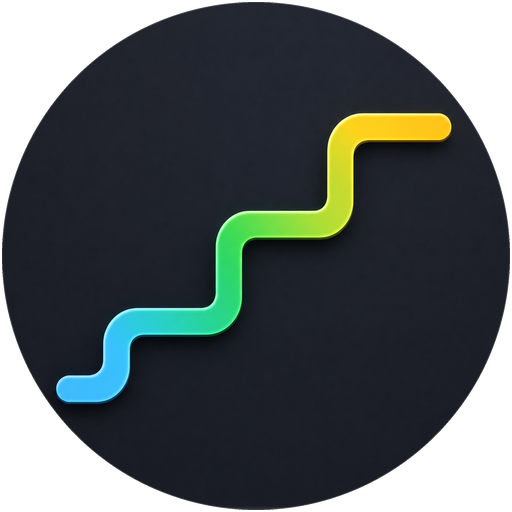

<a name="readme-top"></a>

<div align="center">



<h1>AI Commit Plus</h1>

在 VS Code 中选中暂存区代码，一键生成符合 Conventional Commits 规范的提交消息——支持 OpenAI 兼容接口和 Gemini。

[English](./README.md) · **简体中文** · [报告问题][github-issues-link] · [请求功能][github-issues-link]

[![][github-release-shield]][github-release-link]
[![][github-downloads-shield]][github-downloads-link]
[![][github-contributors-shield]][github-contributors-link]
[![][github-stars-shield]][github-stars-link]
[![][github-issues-shield]][github-issues-link]
[![][github-license-shield]][github-license-link]


</div>

## 功能亮点

- **从 diff 自动生成提交消息** — 将 Git 暂存区变更发送给 OpenAI、Azure OpenAI、DeepSeek 或 Gemini，直接返回符合 Conventional Commits 规范的消息。
- **Gitmoji 与纯文本自由切换** — 一键在 emoji 前缀和纯文本格式之间切换。
- **19 种语言** — 支持中文（简体/繁体）、英文、日文、韩文、法文等语言的提交消息。
- **按仓库覆盖配置** — 不同仓库可以设置不同的提交语言、Prompt 预设和供应商配置。
- **供应商配置（Provider Profiles）** — 保存多组 API 配置，随时切换，不用每次都手动改设置。
- **API Key 安全存储** — 密钥保存在 VS Code SecretStorage 中，不会出现在 settings.json 里。
- **SCM 输入框补充上下文** — 生成前在 Source Control 消息框里输入额外说明，AI 会一并参考。

## 安装

AI Commit Plus 当前通过 GitHub Releases 提供 VSIX 安装包，尚未发布到 VS Code 扩展市场。

1. 从 [GitHub Releases][github-release-link] 下载最新 `.vsix` 文件。
2. 在命令面板中运行 `Extensions: Install from VSIX...`。
3. 选择下载的 `ai-commit-plus-<version>.vsix` 安装。

> 本地开发和打包需要 Node.js `24.14.1` 或更高版本。

## 快速开始

1. 从 GitHub Releases 安装 `.vsix` 包，并启用 `AI Commit Plus`。
2. 在命令面板（`Ctrl+Shift+P`）中运行 `Manage Provider Profiles`。
3. 创建一个配置：选择供应商类型（OpenAI 兼容或 Gemini），填写名称、模型和 API Key。
4. 将需要提交的文件加入暂存区。
5. （可选）在 Source Control 消息框中输入补充说明。
6. 点击 Source Control 标题栏的 **AI Commit Plus** 按钮。
7. 检查生成的消息，确认后提交。

状态栏会显示当前供应商、语言和 Prompt 预设，点击即可快速调整。

## 供应商配置（Provider Profiles）

Profile 用来保存和切换多组 AI 供应商配置。每个 Profile 保存供应商类型、名称、Base URL、模型、Temperature 和 Azure API 版本，API Key 单独存储在 VS Code SecretStorage 中。

| 命令 | 说明 |
| :--- | :--- |
| `Manage Provider Profiles` | 创建、编辑、复制、删除或激活 Profile |
| `Switch Provider Profile` | 快速切换到 Profile 选择界面 |

支持的供应商类型：

- **OpenAI 兼容** — OpenAI、Azure OpenAI、DeepSeek，以及所有兼容 OpenAI Chat Completions 协议的接口。
- **Gemini** — Google Gemini 模型。

## 命令列表

| 命令 | 说明 |
| :--- | :--- |
| `AI Commit Plus` | 根据暂存区变更生成提交消息（显示在 SCM 标题栏） |
| `Manage Provider Profiles` | 添加、编辑、复制或删除供应商配置 |
| `Switch Provider Profile` | 切换当前使用的供应商配置 |
| `Show Available OpenAI Models` | 浏览并选择 OpenAI 兼容接口提供的模型 |
| `Set Commit Language for Current Repository` | 为当前仓库覆盖提交语言设置 |
| `Set Prompt Preset for Current Repository` | 为当前仓库覆盖 Prompt 预设（Gitmoji / 纯文本 / 自定义） |

## 配置项

所有配置均位于 VS Code 的 `ai-commit-plus.` 前缀下。

| 配置项 | 类型 | 默认值 | 说明 |
| :--- | :---: | :---: | :--- |
| `PROVIDER_PROFILES` | array | `[]` | 保存的供应商配置列表；API Key 存储在 SecretStorage 中 |
| `ACTIVE_PROVIDER_PROFILE_ID` | string | `""` | 当前激活的 Profile ID，支持按工作区或文件夹覆盖 |
| `AI_COMMIT_LANGUAGE` | string | `English` | 提交消息语言（共 19 种），支持按仓库覆盖 |
| `PROMPT_PRESET` | string | `without-gitmoji` | Prompt 预设：`with-gitmoji`、`without-gitmoji`、`custom`，支持按仓库覆盖 |
| `AI_COMMIT_SYSTEM_PROMPT` | string | `""` | 自定义系统提示词，`PROMPT_PRESET` 设为 `custom` 时生效 |

## 按仓库覆盖配置

你可以为不同仓库单独设置提交语言、Prompt 预设和供应商配置。覆盖设置会保存为 VS Code 工作区或文件夹级别的配置（通常写入 `.vscode/settings.json`）。

在目标仓库中打开命令面板，运行以下命令：

- `Set Commit Language for Current Repository` — 覆盖提交语言
- `Set Prompt Preset for Current Repository` — 覆盖 Prompt 预设
- `Manage Provider Profiles` → 选择 Profile → **Set for current workspace** — 覆盖供应商配置

> 如果 `.vscode/settings.json` 已被 Git 跟踪，覆盖设置会出现在变更列表中。

## 本地开发

```bash
git clone https://github.com/mizuikki/ai-commit-plus.git
cd ai-commit-plus
npm install
```

在 VS Code 中打开项目后按 `F5` 启动扩展开发宿主。

也可以使用 GitHub Codespaces 在线开发：

[![][github-codespace-shield]][github-codespace-link]

## 贡献

欢迎提交 Issue 和 Pull Request。Bug 反馈、功能建议和讨论都可以在 [GitHub Issues][github-issues-link] 发起。

[![][pr-welcome-shield]][pr-welcome-link]

### 贡献者

[![][github-contrib-shield]][github-contrib-link]

## 项目历史

AI Commit Plus 最初从 [Sitoi/ai-commit](https://github.com/Sitoi/ai-commit) fork 而来，在此基础上独立发展了品牌标识、Provider Profiles、按仓库覆盖配置、Gemini 支持和状态栏整合等功能。

## 致谢

- **auto-commit** — <https://github.com/lynxife/auto-commit>
- **opencommit** — <https://github.com/di-sukharev/opencommit>

## 许可证

本项目基于 [MIT](./license) 许可证发布。

[github-codespace-link]: https://codespaces.new/mizuikki/ai-commit-plus
[github-codespace-shield]: https://github.com/mizuikki/ai-commit-plus/blob/main/images/codespaces.png?raw=true
[github-contributors-link]: https://github.com/mizuikki/ai-commit-plus/graphs/contributors
[github-contributors-shield]: https://img.shields.io/github/contributors/mizuikki/ai-commit-plus?color=c4f042&labelColor=black&style=flat-square
[github-downloads-link]: https://github.com/mizuikki/ai-commit-plus/releases
[github-downloads-shield]: https://img.shields.io/github/downloads/mizuikki/ai-commit-plus/total?label=downloads&labelColor=black&style=flat-square
[github-issues-link]: https://github.com/mizuikki/ai-commit-plus/issues
[github-issues-shield]: https://img.shields.io/github/issues/mizuikki/ai-commit-plus?color=ff80eb&labelColor=black&style=flat-square
[github-license-link]: https://github.com/mizuikki/ai-commit-plus/blob/main/license
[github-license-shield]: https://img.shields.io/github/license/mizuikki/ai-commit-plus?color=white&labelColor=black&style=flat-square
[github-release-link]: https://github.com/mizuikki/ai-commit-plus/releases
[github-release-shield]: https://img.shields.io/github/v/release/mizuikki/ai-commit-plus?display_name=tag&label=release&color=blue&labelColor=black&style=flat-square
[github-stars-link]: https://github.com/mizuikki/ai-commit-plus/stargazers
[github-stars-shield]: https://img.shields.io/github/stars/mizuikki/ai-commit-plus?color=ffcb47&labelColor=black&style=flat-square
[pr-welcome-link]: https://github.com/mizuikki/ai-commit-plus/pulls
[pr-welcome-shield]: https://img.shields.io/badge/PRs-welcome-ffcb47?labelColor=black&style=for-the-badge
[github-contrib-link]: https://github.com/mizuikki/ai-commit-plus/graphs/contributors
[github-contrib-shield]: https://contrib.rocks/image?repo=mizuikki%2Fai-commit-plus
